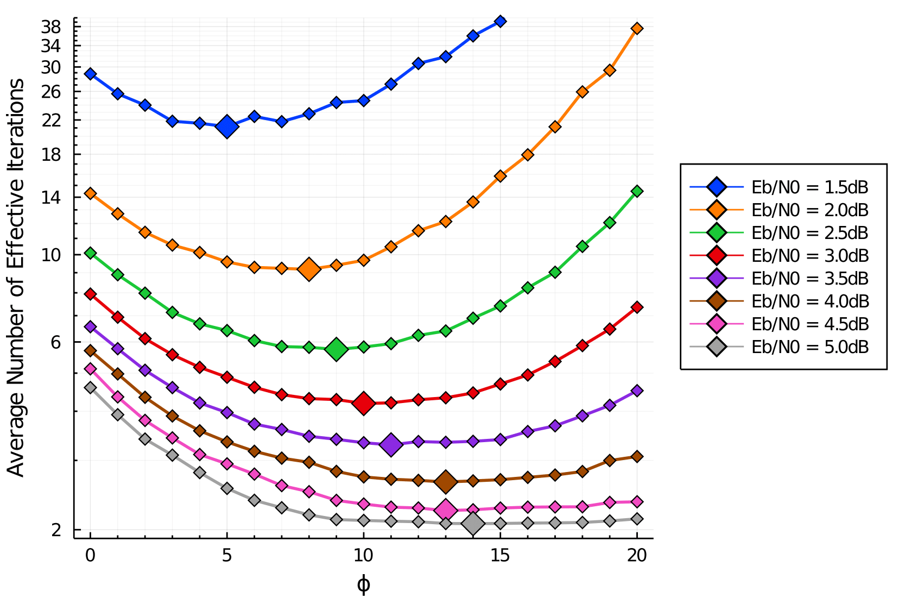

# Randomized-Layered-ADMM-LP
This repository includes the codes for the novel randomized scheduling strategy introduced in the paper:
[Randomized Scheduling of ADMM-LP Decoding Based on Geometric Priors]([https://ieeexplore.ieee.org/stamp/stamp.jsp?arnumber=9965857](https://ieeexplore.ieee.org/abstract/document/9965857), 
presented in ITW '22, 
and part of my masters thesis,
[Approximate and Randomized ADMM-LP Decoding Using the Geometric Information of the Parity Polytope](https://tspace.library.utoronto.ca/bitstream/1807/125679/1/Asadzadeh_Amirreza_202211_MAS_thesis.pdf).

## Background
This project is focused on decoding low-density parity-check (LDPC) codes using an alternating direction method of multipliers (ADMM) framework
for solving the linear-programming (LP) decoding problem. This algorithm was initially introduced in the paper [Decomposition Methods for Large Scale LP Decoding](https://ieeexplore.ieee.org/abstract/document/6595057) and was significantly improved in the papers
[the ADMM Penalized Decoder for LDPC Codes](https://ieeexplore.ieee.org/abstract/document/7456284) and [Hardware Based Projection onto the Parity Polytope and Probability Simplex](https://ieeexplore.ieee.org/abstract/document/7421292).

ADMM-LP decoding algorithm iteratively applies message passing decoding on the bipartite Tanner graph of LDPC codes, while stroing the residual information in the Lagrange multipliers. The original update schedule of the nodes, dictated by the ADMM formulation in the [original paper](https://ieeexplore.ieee.org/abstract/document/6595057), first updates the $N$ variable nodes, and then the $M$ check nodes of the graph. This schedule is known as the flooding schedule. The following papers [Fastconverging ADMM-penalized algorithm for LDPC decoding](https://ieeexplore.ieee.org/document/7409989)
and [Comparison of different schedulings for the ADMM based LDPC decoding](https://ieeexplore.ieee.org/document/7593075)
investigate node-wise layered schedules and show through experiments, that the decoder converges faster when implemented under these layered schedules.

## Idea
In this project, inpired by the previous works on layered scheduling of ADMM-LP decoding, we introduce a novel *randomized* layered scheduling,
in order to further boost the convergence of the iterative ADMM-LP decoding algorithm.
The general idea of our randomized schedule is to choose nodes to be updated randomly, but wisely at each decoding round,
using the state information of the graph.
This allows us to focus more on updating the more problematic nodes of the graph, while visiting the more satisfied nodes less frequently.
The difference between this randomized layered schedule and the previous *greedy* layered schedules is that,
by using the randomized schedule we do not neglect visiting the satisfied nodes at all,
which could eventually be useful to propagate more *correct* information through the graph,
and let the consecutive updates be more *accurate*.

More formally, assume there are $M$ check nodes in the Tanner graph of the LDPC code, one for each parity-check constraint.
We induce a probability mass function (PMF) over the indices of the $M$ check nodes, and then in each decoding round,
we choose one check node based on the introduced PMF to update.
Specifically, we induce the [Boltzmann distribution](https://en.wikipedia.org/wiki/Boltzmann_distribution) (or equivalently,
apply the [Softmax function](https://en.wikipedia.org/wiki/Softmax_function)) over the check indices,
such that the probability of choosing the $j$-th check node with replica vector $z_j$ of dimension $d_j$ becomes
$$\pi_j = \frac{\exp(-\phi||z_j - 0.5\mathbf{1}_{d_j}||_2)}{\mathcal{Z}},$$
where $\phi$ and $\mathcal{Z}$ are the hyperparameter of the model and the normalization parameter, respectively.

The sharpness of the PMF can be tuned via changing the hyperparamter $\phi$.
It can be shown easily that when $\phi$ goes to $0$, the resulting PMF becomes uniform and completely random over the check indices,
while as $\phi$ goes to $\infty$, the scheduling strategy becomes completely greedy.
Through simulations, we show the optimal $\phi$ depends strongly on the operating Signal-to-Noise (SNR) ratio.
As the following figure suggests, it is more advised to set $\phi$ to small values when SNR is low,
and as SNR increases, the optimal $\phi$ grows accordingly.

